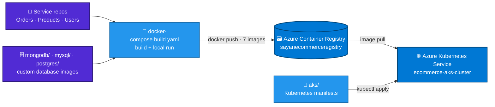

<div align="center">

# 🧰 eCommerce Microservices — Docker, AKS & Azure Assets

**Companion repository for the eCommerce microservices project: the Compose file that builds every container image, the custom database images, the Kubernetes manifests used on Azure Kubernetes Service, and screenshots from every stage of the build.**


**[Contents](#-whats-in-this-repo) · [Build locally](#-build-and-run-locally) · [Deploy to AKS](#-deploy-to-aks) · [Troubleshooting](#-troubleshooting) · [Snapshots](#-project-snapshots)**

</div>

---

## 📂 What's in this repo

```text
ecommerce_microservice_proj_docker_aks_azure_related_files/
├── docker-compose.build.yaml   # builds and runs the full 9-container stack
├── mongodb/                    # Dockerfile for the custom ecommerce-mongodb image
├── mysql/                      # Dockerfile for the custom ecommerce-mysql image
├── postgres/                   # Dockerfile for the custom ecommerce-postgres image
├── aks/                        # Kubernetes manifests used to deploy the stack to AKS
└── Docker_aks_Azure_docs/      # 31 screenshots documenting each stage of the project
```

| Path | Purpose |
|---|---|
| [`docker-compose.build.yaml`](docker-compose.build.yaml) | Builds the seven project images (gateway, three services, three databases) from source and runs them together with Redis and RabbitMQ on four isolated bridge networks. |
| [`mongodb/`](mongodb) · [`mysql/`](mysql) · [`postgres/`](postgres) | Build contexts for the project's own database images — `ecommerce-mongodb`, `ecommerce-mysql` and `ecommerce-postgres` — which run on AKS in place of the stock images. |
| [`aks/`](aks) | Kubernetes manifests for the AKS deployment — the objects they create are listed in [Deploy to AKS](#-deploy-to-aks). |
| [`Docker_aks_Azure_docs/`](Docker_aks_Azure_docs) | Screenshots from local Docker runs through AKS, Azure DevOps, API Management, Entra External ID and Service Bus — browse them in [Project Snapshots](#-project-snapshots). |

## 🔗 Related repositories

The application code lives in the service repositories. The Compose file expects them to be cloned **next to this repository** (see [Build and run locally](#-build-and-run-locally)).

| Component | Repository |
|---|---|
| 📦 Orders service + API Gateway project | [eCommerceSolution.OrdersService](https://github.com/sayanpr8175/eCommerceSolution.OrdersService) |
| 🏷️ Products service | [eCommerceSolution.ProductsService](https://github.com/sayanpr8175/eCommerceSolution.ProductsService) |
| 👤 Users service | [eCommerceSolution.UsersService](https://github.com/sayanpr8175/eCommerceSolution.UsersService) |
| 🚪 API Gateway (standalone repo) | [eCommerceSolution.ApiGateway](https://github.com/sayanpr8175/eCommerceSolution.ApiGateway) |

## 🧭 How the pieces fit



One Compose file builds every image the cluster needs. The images are pushed to Azure Container Registry, and the manifests in `aks/` run them on AKS.

---

## 🐳 Build and run locally

### Prerequisites

- Docker Desktop with Compose v2
- The three service repositories, cloned side by side with this one:

```text
your-workspace/
├── ecommerce_microservice_proj_docker_aks_azure_related_files/   ← this repo
├── eCommerceSolution.OrdersService/
├── eCommerceSolution.ProductsService/
└── eCommerceSolution.UsersService/
```

```bash
git clone https://github.com/sayanpr8175/ecommerce_microservice_proj_docker_aks_azure_related_files.git
git clone https://github.com/sayanpr8175/eCommerceSolution.OrdersService.git
git clone https://github.com/sayanpr8175/eCommerceSolution.ProductsService.git
git clone https://github.com/sayanpr8175/eCommerceSolution.UsersService.git
```

### Build and start the stack

```bash
cd ecommerce_microservice_proj_docker_aks_azure_related_files

docker compose -f docker-compose.build.yaml build      # build the 7 project images
docker compose -f docker-compose.build.yaml up -d      # start all 9 containers
docker compose -f docker-compose.build.yaml ps         # check they are running
```

Once it's up:

| Endpoint | URL |
|---|---|
| API Gateway (single entry point) | `http://localhost:5000/gateway/...` — e.g. `http://localhost:5000/gateway/products/` |
| RabbitMQ management UI | `http://localhost:15672` (`guest` / `guest`) |
| MongoDB · MySQL · PostgreSQL · Redis | `localhost:27017` · `localhost:3306` · `localhost:5432` · `localhost:6379` |

The three microservices publish no host ports; every request goes through the gateway.

### Services

| Service | Image | Build context | Host port | Networks |
|---|---|---|---|---|
| `mongodb-container` | `ecommerce-mongodb` | `mongodb/` | `27017` | `orders-mongodb-network` |
| `mysql-container` | `ecommerce-mysql` | `mysql/` | `3306` | `products-mysql-network` |
| `postgres-container` | `ecommerce-postgres` | `postgres/` | `5432` | `users-postgres-network` |
| `redis` | `redis:latest` *(pulled)* | — | `6379` | `ecommerce-network` |
| `rabbitmq` | `rabbitmq:3.8-management` *(pulled)* | — | `5672`, `15672` | `ecommerce-network` |
| `apigateway` | `apigateway` | `../eCommerceSolution.OrdersService` · `ApiGateway/Dockerfile` | `5000 → 8080` | `ecommerce-network` |
| `users-microservice` | `users-microservice` | `../eCommerceSolution.UsersService` · `eCommerce.API/Dockerfile` | — | `users-postgres-network`, `ecommerce-network` |
| `products-microservice` | `products-microservice` | `../eCommerceSolution.ProductsService` · `ProductsMicroService.API/Dockerfile` | — | `products-mysql-network`, `ecommerce-network` |
| `orders-microservice` | `orders-microservice` | `../eCommerceSolution.OrdersService` · `OrdersMicroservice.API/Dockerfile` | — | `orders-mongodb-network`, `ecommerce-network` |

**Network isolation:** each database sits on a private bridge network shared only with the service that owns it. The gateway, the three services, Redis and RabbitMQ share `ecommerce-network`. The Orders service reaches Users and Products **through the gateway** (`UsersMicroserviceName` and `ProductsMicroserviceName` both point at `apigateway`), so all service-to-service HTTP takes the same route as client traffic.

<details>
<summary><b>Environment variables set by the Compose file</b></summary>
<br/>

| Service | Variables |
|---|---|
| `users-microservice` | `POSTGRES_HOST=postgres-container` · `POSTGRES_PORT=5432` · `POSTGRES_DATABASE=eCommerceUsers` · `POSTGRES_USER` / `POSTGRES_PASSWORD` · `RabbitMQ_HostName=rabbitmq` · `RabbitMQ_Port=5672` · `RabbitMQ_UserName` / `RabbitMQ_Password` · `RabbitMQ_Users_Exchange=users.exchange` |
| `products-microservice` | `MYSQL_HOST=mysql-container` · `MYSQL_PORT=3306` · `MYSQL_DATABASE=ecommerceproductsdatabase` · `MYSQL_USER` / `MYSQL_PASSWORD` · `RabbitMQ_HostName=rabbitmq` · `RabbitMQ_Port=5672` · `RabbitMQ_UserName` / `RabbitMQ_Password` · `RabbitMQ_Products_Exchange=products.exchange` |
| `orders-microservice` | `MONGODB_HOST=mongodb-container` · `MONGODB_PORT=27017` · `MONGODB_DATABASE=OrdersDatabase` · `UsersMicroserviceName=apigateway` · `UsersMicroservicePort=8080` · `ProductsMicroserviceName=apigateway` · `ProductsMicroservicePort=8080` · `REDIS_HOST=redis` · `REDIS_PORT=6379` · `RabbitMQ_HostName=rabbitmq` · `RabbitMQ_Port=5672` · `RabbitMQ_UserName` / `RabbitMQ_Password` · `RabbitMQ_Products_Exchange=products.exchange` · `RabbitMQ_Users_Exchange=users.exchange` |

All three services also run with `ASPNETCORE_ENVIRONMENT=Development`.

</details>

> [!NOTE]
> The build paths in the Compose file start with `/`, for example `context: /mongodb` and `context: /../eCommerceSolution.OrdersService`. That worked on the Windows machine the images were built on. On Linux and macOS a leading `/` means an absolute path, so write them as `./mongodb` and `../eCommerceSolution.OrdersService` there.

> [!WARNING]
> The credentials in the Compose file (`admin` database passwords, RabbitMQ `guest` / `guest`) are local development defaults. Don't reuse them outside your machine.

## 📤 Push the images to Azure Container Registry

The seven images the Compose file builds are the seven repositories in `sayanecommerceregistry`: `apigateway`, `orders-microservice`, `products-microservice`, `users-microservice`, `ecommerce-mongodb`, `ecommerce-mysql` and `ecommerce-postgres`.

```bash
az login
az acr login --name sayanecommerceregistry

for image in apigateway orders-microservice products-microservice users-microservice \
             ecommerce-mongodb ecommerce-mysql ecommerce-postgres; do
  docker tag  "$image:latest" "sayanecommerceregistry.azurecr.io/$image:latest"
  docker push "sayanecommerceregistry.azurecr.io/$image:latest"
done
```

<details>
<summary>PowerShell version</summary>

```powershell
az login
az acr login --name sayanecommerceregistry

$images = "apigateway","orders-microservice","products-microservice","users-microservice",
          "ecommerce-mongodb","ecommerce-mysql","ecommerce-postgres"
foreach ($image in $images) {
  docker tag  "${image}:latest" "sayanecommerceregistry.azurecr.io/${image}:latest"
  docker push "sayanecommerceregistry.azurecr.io/${image}:latest"
}
```

</details>

If you use your own registry, replace `sayanecommerceregistry` here and in the image names inside the `aks/` manifests.

---

## 🚢 Deploy to AKS

### Prerequisites

- Azure CLI, signed in to the subscription that holds `ecommerce-resource-group`
- `kubectl` (`az aks install-cli` installs it)
- An AKS cluster and the images pushed to ACR — this project uses `ecommerce-aks-cluster` and `sayanecommerceregistry`

### Steps

```bash
# 1. Point kubectl at the cluster
az aks get-credentials --resource-group ecommerce-resource-group --name ecommerce-aks-cluster

# 2. Let the cluster pull images from the registry (one-time)
az aks update --resource-group ecommerce-resource-group --name ecommerce-aks-cluster \
  --attach-acr sayanecommerceregistry

# 3. Create the namespace and make it the default for kubectl
kubectl create namespace ecommerce-namespace
kubectl config set-context --current --namespace=ecommerce-namespace

# 4. Apply every manifest in aks/
kubectl apply -f aks/ --recursive

# 5. Watch the pods come up
kubectl get all
```

### What runs on the cluster

These are the objects running in `ecommerce-namespace` once everything is up (snapshot 07). Each component runs as one replica.

| Component | Deployment | Service | Type | Port(s) |
|---|---|---|---|---|
| 🚪 Ocelot API Gateway | `apigateway-deployment` | `apigateway` | **LoadBalancer** | `8080` |
| 📦 Orders | `orders-microservice-deployment` | `orders-microservice` | ClusterIP | `8080` |
| 🏷️ Products | `products-microservice-deployment` | `products-microservice` | ClusterIP | `8080` |
| 👤 Users | `users-microservice-deployment` | `users-microservice` | ClusterIP | `9090` |
| 🍃 MongoDB | `mongodb-deployment` | `mongodb` | ClusterIP | `27017` |
| 🐬 MySQL | `mysql-deployment` | `mysql` | ClusterIP | `3306` |
| 🐘 PostgreSQL | `postgres-deployment` | `postgres` | ClusterIP | `5432` |
| ⚡ Redis | `redis-deployment` | `redis` | ClusterIP | `6379` |
| 🐇 RabbitMQ | `rabbitmq-deployment` | `rabbitmq` | ClusterIP | `5672`, `15672` |

Only the gateway gets a public IP; everything else is reachable only inside the cluster, by Service name. The cluster also has a `dev` namespace, which is the deployment target of the Azure DevOps pipelines in the service repositories (snapshots 15 – 23).

### Verify

```bash
kubectl get service apigateway                    # copy the EXTERNAL-IP
curl http://<EXTERNAL-IP>:8080/gateway/orders     # should return the orders as JSON
```

In the full setup, Azure API Management sits in front of this address (snapshots 24 – 26).

---

## 🩺 Troubleshooting

### Pods stuck in `CrashLoopBackOff`

**Symptom:** a pod starts, crashes, and its `RESTARTS` count keeps climbing.

```bash
kubectl get pods                      # RESTARTS keeps going up
kubectl logs <pod-name> --previous    # output of the container that just crashed
kubectl describe pod <pod-name>       # events, exit code, image pull errors
```

**Cause:** Kubernetes adds environment variables for every Service in the namespace. Because this stack's Services are named `mongodb`, `mysql`, `postgres`, `redis` and `rabbitmq`, those variables include `MONGODB_PORT=tcp://<cluster-ip>:27017` and similar. They share names with settings the services read (`MONGODB_PORT`, `MYSQL_PORT`, `POSTGRES_PORT`, `REDIS_PORT`). .NET configuration keys are case-insensitive, so `RABBITMQ_PORT` also lands on `RabbitMQ_Port`. A `tcp://...` address where a port number is expected crashes the service on startup, and Kubernetes keeps restarting it.

**Fix:** either set each such variable explicitly in the Deployment's `env` (explicit values take precedence over injected ones), or switch the injection off for the pod:

```yaml
spec:
  template:
    spec:
      enableServiceLinks: false   # stop Kubernetes injecting <SERVICE>_HOST / <SERVICE>_PORT variables
```

Locally this never shows up, because the Compose services are named `mongodb-container`, `mysql-container` and so on, which don't produce clashing variables.

---

## 🔷 Azure resources

All in `ecommerce-resource-group`, East US (snapshot 12).

| Resource | Name | Role in the project |
|---|---|---|
| Kubernetes Service | `ecommerce-aks-cluster` | Runs the stack in `ecommerce-namespace` and `dev` |
| Container Registry | `sayanecommerceregistry` | Stores the 7 project images |
| Key Vault | `products-pipeline-sayan` | Secrets for the Azure DevOps pipelines |
| API Management | `sayan-ecommerce-api` | HTTPS front door: APIs imported from OpenAPI, CORS and JWT-validation policies |
| Service Bus namespace | `ecommerce-sayan-servicebus-namespace` | `products.updates` and `orders.placed` topics |
| External ID tenant | `sayanecommercedev.onmicrosoft.com` | Customer sign-up and sign-in with Microsoft Entra External ID, used because Azure AD B2C is no longer offered to new customers |

---

## 📸 Project Snapshots

All 31 screenshots live in [`Docker_aks_Azure_docs/`](Docker_aks_Azure_docs), grouped below by project phase. Expand a phase to see its snapshots, and click any image to open it full size.

<details>
<summary><b>🐳 Phase 1 — Local development with Docker Compose</b> · 01 – 03</summary>
<br/>

**01 · Reading data from the running MySQL container**<br/>
Querying product data directly inside the running MySQL container.

![Reading data from the running MySQL container][s01]

**02 · All containers running together**<br/>
Visual Studio's *Containers* window with the Compose project up — MongoDB, MySQL, PostgreSQL and the Orders, Products and Users services — while the MongoDB container streams its logs.

![All containers running together][s02]

**03 · API running from its container**<br/>
A service API running from its container.

![API running from its container][s03]

</details>

<details>
<summary><b>🚪 Phase 2 — API gateway (Ocelot)</b> · 04</summary>
<br/>

**04 · Ocelot rate limiter in action**<br/>
A `GET /gateway/Products/` beyond the allowed quota is rejected at the gateway with `429 Too Many Requests` and Ocelot's quota-exceeded message — the Products service never sees the call.

![Ocelot rate limiter returning 429][s04]

</details>

<details>
<summary><b>🐇 Phase 3 — Event-driven messaging with RabbitMQ</b> · 05 – 06</summary>
<br/>

**05 · Delete queue bound alongside the update queue**<br/>
RabbitMQ bindings with the delete queue bound next to the update queue.

![RabbitMQ delete queue bound alongside the update queue][s05]

**06 · Publishing to the products exchange**<br/>
A `PUT /gateway/products` updates a product (`200 OK`) and the RabbitMQ management UI records the publish on `products.exchange`. Captured during the direct-exchange iteration, before routing moved to a headers exchange.

![Publishing a message to the products exchange][s06]

</details>

<details>
<summary><b>🚢 Phase 4 — Kubernetes on AKS</b> · 07 – 14</summary>
<br/>

**07 · Cluster state after applying the Service manifests**<br/>
`kubectl get all`: every Deployment at 1/1, ClusterIP Services for the internal components, and a LoadBalancer Service with a public IP for the gateway.

![Cluster state after deploying the Service manifests][s07]

**08 · Troubleshooting deployment issues**<br/>
Working through deployment issues with `kubectl`.

![kubectl deployment issues][s08]

**09 · Results after fixing the Service manifest**<br/>
Requests answered from Azure once the Service manifest was corrected.

![Results from Azure after fixing the Service manifest][s09]

**10 · Services registered in AKS**<br/>
The cluster's Kubernetes Services as registered in AKS.

![AKS services registered][s10]

**11 · Pods running after a successful deployment**<br/>
All pods up and running after a successful rollout.

![Pods running after a successful deployment][s11]

**12 · Project resource group**<br/>
`ecommerce-resource-group` (East US) holds the AKS cluster, Container Registry, Key Vault, API Management, the Service Bus namespace and the External ID tenant.

![Project Azure resource group][s12]

**13 · AKS workloads**<br/>
The full stack in two namespaces — `ecommerce-namespace` and the pipeline-managed `dev` — nine Deployments each, all ready.

![AKS workloads across namespaces][s13]

**14 · Azure Container Registry**<br/>
`sayanecommerceregistry` with seven repositories: the gateway, the three services and the three database images.

![Azure Container Registry repositories][s14]

</details>

<details>
<summary><b>🔁 Phase 5 — CI/CD with Azure DevOps</b> · 15 – 23</summary>
<br/>

**15 · All services deployed through Azure Pipelines**<br/>
One pipeline per service — Users, Orders, Products — each green on its latest `dev` run.

![All microservices deployed through Azure Pipelines][s15]

**16 · Calling the services after the pipeline deployments**<br/>
Pods healthy in both namespaces, each namespace's gateway on its own LoadBalancer IP, and a `GET /gateway/orders` returning composed orders with product and buyer details.

![Requests to each microservice after the DevOps deployment][s16]

**17 · Products microservice in Azure Repos**<br/>
The Products microservice repository in Azure Repos.

![Products microservice in Azure Repos][s17]

**18 · Users microservice pipeline**<br/>
The Users microservice pipeline in Azure DevOps.

![Users microservice pipeline][s18]

**19 · Azure Key Vault**<br/>
The Azure Key Vault behind the pipeline's secrets.

![Azure Key Vault][s19]

**20 · Key Vault secrets flowing into the pipeline**<br/>
Products pipeline mid-run: secrets fetched from Key Vault, image built and pushed, unit tests running, deployment waiting its turn.

![Key Vault variables integrated into the DevOps pipeline][s20]

**21 · The same run, completed**<br/>
All four stages green, 100 % of tests passed and the deployment check passed.

![Key Vault integration — successful pipeline run][s21]

**22 · Unit tests running in the pipeline**<br/>
Products microservice tests running in the pipeline.

![Products microservice tests in the pipeline][s22]

**23 · Published test results**<br/>
Test results for the Products microservice in the pipeline run.

![Products microservice test results][s23]

</details>

<details>
<summary><b>🛡️ Phase 6 — Azure API Management</b> · 24 – 26</summary>
<br/>

**24 · APIs imported from OpenAPI**<br/>
The three APIs created from each service's OpenAPI document; the test console sends a login request through the APIM hostname.

![All API endpoints imported through OpenAPI specifications][s24]

**25 · Inbound processing on the Orders API**<br/>
All Orders operations share `base` → `cors` → `validate-jwt` inbound policies, and the backend points at the Ocelot gateway on AKS.

![Updated inbound processing in API Management][s25]

**26 · A response through the APIM URL**<br/>
`200 OK` for *Get all products* via API Management. The `x-rate-limit-*` headers are Ocelot's, showing the request travelled APIM → Ocelot → Products.

![Response through the Azure API Management URL][s26]

</details>

<details>
<summary><b>🔐 Phase 7 — Microsoft Entra External ID</b> · 27 – 28</summary>
<br/>

**27 · App registration for the client**<br/>
*eCommerce Client* registered as a single-page application in the External ID tenant, with its redirect and front-channel logout URIs.

![Microsoft Entra app registration][s27]

**28 · Hosted sign-up page**<br/>
The tenant-branded sign-up page on `ciamlogin.com`, collecting given name and surname during registration.

![Entra External ID CIAM sign-up page][s28]

</details>

<details>
<summary><b>📨 Phase 8 — Azure Service Bus</b> · 29 – 31</summary>
<br/>

**29 · A product update reaching the topic**<br/>
A product `PUT` through API Management (`200 OK`) and the `products.updates` topic metrics moving with it — messages in equal messages out, with no server errors.

![Service Bus message going through][s29]

**30 · Peeking the Orders subscription**<br/>
Service Bus Explorer on `products.updates.orders`: the product JSON in the body, `event: product.update` and `RowCount: 1` as custom properties, and an empty dead-letter queue.

![Service Bus message peeked][s30]

**31 · Both transports delivering**<br/>
Orders logs: every product update arrives twice — once from the RabbitMQ consumer and once from the Service Bus consumer, tagged *Servicebus notification*.

![Service Bus and RabbitMQ consumers logging each update][s31]

<!-- Snapshot slot: add the orders.placed → stock decrement flow here as "32 · ..." and a matching [s32] link in the block at the end of this file. -->

</details>

---

<div align="center">

**Part of the eCommerce Microservices project** · [Orders](https://github.com/sayanpr8175/eCommerceSolution.OrdersService) · [Products](https://github.com/sayanpr8175/eCommerceSolution.ProductsService) · [Users](https://github.com/sayanpr8175/eCommerceSolution.UsersService) · [API Gateway](https://github.com/sayanpr8175/eCommerceSolution.ApiGateway)

⭐ Star the repos if this was useful to you

</div>

<!-- Snapshot image links (relative to this repo) -->

[s01]: Docker_aks_Azure_docs/1_accessing_data_from_running_mysql_docker_container.PNG
[s02]: Docker_aks_Azure_docs/2_all_containers_running_together.PNG
[s03]: Docker_aks_Azure_docs/3_api_running_from_container.PNG
[s04]: Docker_aks_Azure_docs/3_z_ocelot_ratelimiter_working.PNG
[s05]: Docker_aks_Azure_docs/4_rabbit_mq_delete_queuebinded_to_update.PNG
[s06]: Docker_aks_Azure_docs/5_publishing_message_to_new_products_exchange.PNG
[s07]: Docker_aks_Azure_docs/6_after_deploying_Service_manifest.PNG
[s08]: Docker_aks_Azure_docs/kubectl_deployment_issues.PNG
[s09]: Docker_aks_Azure_docs/getting_results_from_azure_after%20fixing_service_manifest.PNG
[s10]: Docker_aks_Azure_docs/7_aks_service_registered.PNG
[s11]: Docker_aks_Azure_docs/pods_running_after_successful_deployment.PNG
[s12]: Docker_aks_Azure_docs/8_project_azure_resource_group.PNG
[s13]: Docker_aks_Azure_docs/9_azure_aks_ecom_kubernetes_cluster.PNG
[s14]: Docker_aks_Azure_docs/9_z_azure_container_registry.PNG
[s15]: Docker_aks_Azure_docs/10_azure_all_microservices_deployed_through_azure_pipeline.PNG
[s16]: Docker_aks_Azure_docs/6_z_sending_request_to_each_microservices_after_devops_dep.PNG
[s17]: Docker_aks_Azure_docs/11_Azure_Repo_product_microservices.PNG
[s18]: Docker_aks_Azure_docs/users_microservice_pipeline.PNG
[s19]: Docker_aks_Azure_docs/12_z_azure_key_vault.PNG
[s20]: Docker_aks_Azure_docs/12_integrated_access_to_variables_from_azure_keyvault_into_devops_pipeline.PNG
[s21]: Docker_aks_Azure_docs/13_integrated_access_to_variables_from_azure_keyvault_into_devops_pipeline_successful.PNG
[s22]: Docker_aks_Azure_docs/13_z_Azure_pipeline_tests_product_microservices.PNG
[s23]: Docker_aks_Azure_docs/14_Azure_pipeline_tests_results_product_microservices.PNG
[s24]: Docker_aks_Azure_docs/15_azure_api_gateway_all_the_api_endpoints_havebeen_imported_through_openapi_specifications.PNG
[s25]: Docker_aks_Azure_docs/16_azure_api_gateway_imported_through_openapi_specifications_updated_inbound_processing.PNG
[s26]: Docker_aks_Azure_docs/16_z_getting_response_through_azure_api_management_hitting%20through_azure_url.PNG
[s27]: Docker_aks_Azure_docs/17_Microsoft_entra_auth_id.PNG
[s28]: Docker_aks_Azure_docs/18_azure_entra_external_id_ciam_login.PNG
[s29]: Docker_aks_Azure_docs/19_Azure_service_bus_message_going_through.PNG
[s30]: Docker_aks_Azure_docs/20_Azure_service_bus_message_peeked.PNG
[s31]: Docker_aks_Azure_docs/21_Azure_service_bus_message_going_through2.PNG
