<div align="center">

# ☁️ eCommerce Microservices — Docker, AKS & Azure

**Deployment assets and a 31-screenshot build log for a .NET 8 eCommerce microservices platform, from the first Docker Compose run to Azure Kubernetes Service, Azure DevOps CI/CD, API Management, Microsoft Entra External ID and Azure Service Bus.**


**[📸 Snapshots](#-project-snapshots) · [📂 Contents](#-whats-in-this-repository) · [📐 Architecture](#-architecture) · [🚀 Usage](#-using-these-files) · [🔗 Code](#-code-repositories)**

</div>

---

## 🎯 About

The platform is three ASP.NET Core 8 microservices (**Users**, **Products** and **Orders**), each with its own database, behind an Ocelot API gateway. It talks to Redis for caching and to RabbitMQ and Azure Service Bus for events.

The application code lives in the four [code repositories](#-code-repositories). This repository holds everything around that code: the Compose file that builds and runs the whole stack, the Kubernetes manifests used on Azure Kubernetes Service, the custom database images, and the screenshots that document each stage of the build.

## 📂 What's in This Repository

| Path | Contents |
|---|---|
| [`Docker_aks_Azure_docs/`](Docker_aks_Azure_docs) | The 31 project screenshots, shown in [Project Snapshots](#-project-snapshots) below |
| [`aks/`](aks) | Kubernetes manifests (Deployments and Services) for the nine components, applied to `ecommerce-aks-cluster` |
| [`mongodb/`](mongodb) · [`mysql/`](mysql) · [`postgres/`](postgres) | Dockerfiles for the custom database images `ecommerce-mongodb`, `ecommerce-mysql` and `ecommerce-postgres` |
| [`docker-compose.build.yaml`](docker-compose.build.yaml) | Builds and runs the full nine-container stack locally: three services, the gateway, three databases, Redis and RabbitMQ |

---

## 📸 Project Snapshots

31 screenshots across eight phases, in the order the project was built. Every phase is expanded by default: click a phase's 📸 line to collapse it, or click any image to open it at full size.

| Phase | Focus | Snapshots |
|:---:|---|:---:|
| 1 | [🐳 Local development with Docker Compose](#-phase-1--local-development-with-docker-compose) | 01 – 03 |
| 2 | [🚪 API gateway with Ocelot](#-phase-2--api-gateway-with-ocelot) | 04 |
| 3 | [🐇 Event-driven messaging with RabbitMQ](#-phase-3--event-driven-messaging-with-rabbitmq) | 05 – 06 |
| 4 | [🚢 Kubernetes on AKS](#-phase-4--kubernetes-on-aks) | 07 – 14 |
| 5 | [🔁 CI/CD with Azure DevOps](#-phase-5--cicd-with-azure-devops) | 15 – 23 |
| 6 | [🚦 Azure API Management](#-phase-6--azure-api-management) | 24 – 26 |
| 7 | [🔐 Microsoft Entra External ID](#-phase-7--microsoft-entra-external-id) | 27 – 28 |
| 8 | [📨 Azure Service Bus](#-phase-8--azure-service-bus) | 29 – 31 |

### 🐳 Phase 1 — Local development with Docker Compose

Every service and database runs in its own container, and each database sits on a private bridge network that only its owning service can reach.

<details open>
<summary><b>📸 Snapshots 01 – 03</b></summary>
<br/>

**01 · Reading data from the running MySQL container**<br/>
Querying the product data directly inside the running MySQL container.

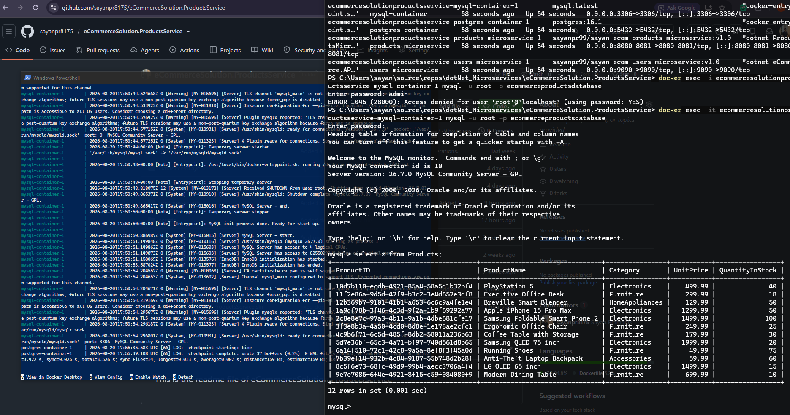

**02 · All containers running together**<br/>
Visual Studio's *Containers* window with the Compose project up (MongoDB, MySQL, PostgreSQL and the Orders, Products and Users services) while the MongoDB container streams its logs.

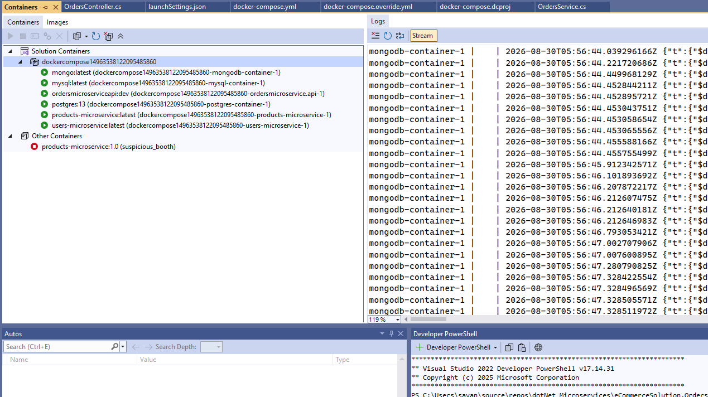

**03 · API running from its container**<br/>
A service API answering requests from inside its container.

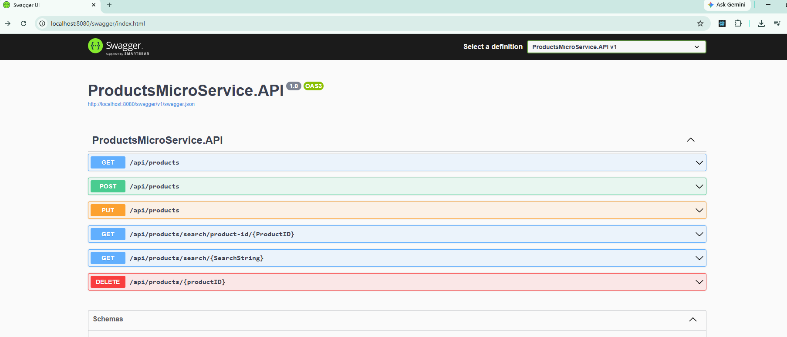

</details>

<p align="right"><a href="#-project-snapshots">↑ Back to the phase list</a></p>

### 🚪 Phase 2 — API gateway with Ocelot

A single Ocelot entry point routes every request under `/gateway/*` and applies per-route QoS and rate limiting.

<details open>
<summary><b>📸 Snapshots 04</b></summary>
<br/>

**04 · Ocelot rate limiter in action**<br/>
A `GET /gateway/Products/` beyond the allowed quota is rejected at the gateway with `429 Too Many Requests` and Ocelot's quota-exceeded message. The Products service never sees the call.

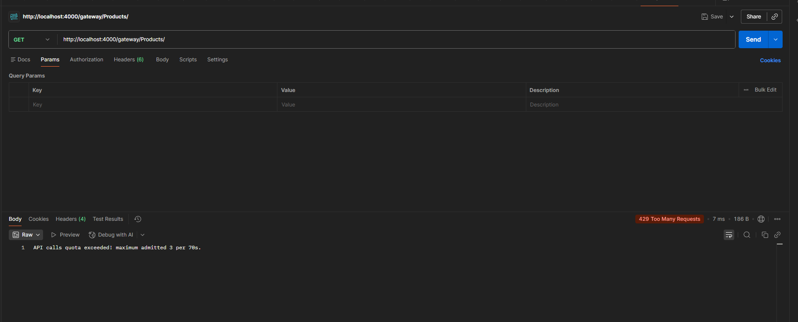

</details>

<p align="right"><a href="#-project-snapshots">↑ Back to the phase list</a></p>

### 🐇 Phase 3 — Event-driven messaging with RabbitMQ

Product changes are broadcast through RabbitMQ, so the Orders service can refresh or evict its Redis cache without polling.

<details open>
<summary><b>📸 Snapshots 05 – 06</b></summary>
<br/>

**05 · Delete queue bound alongside the update queue**<br/>
The product-delete queue bound in RabbitMQ next to the product-update queue.

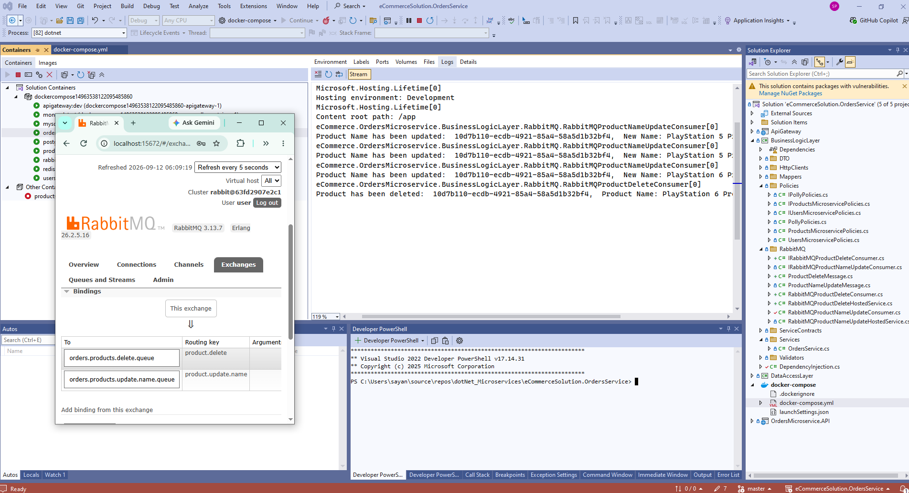

**06 · Publishing to the products exchange**<br/>
A `PUT /gateway/products` updates a product (`200 OK`) and the RabbitMQ management UI records the publish on `products.exchange`. Captured during the direct-exchange iteration, before routing moved to a headers exchange.

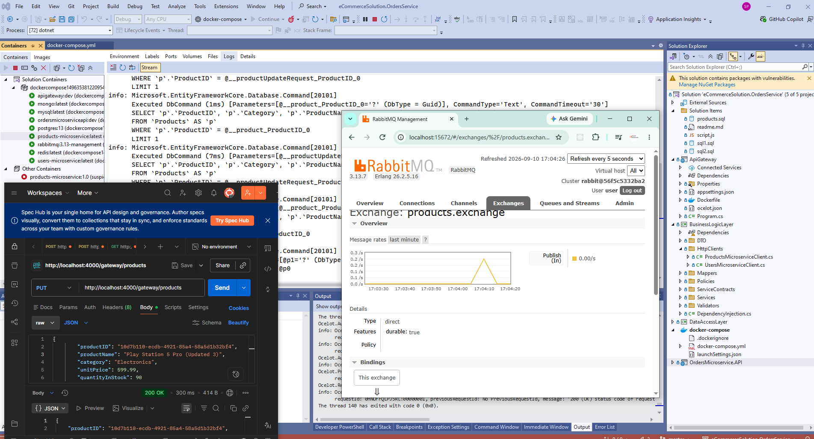

</details>

<p align="right"><a href="#-project-snapshots">↑ Back to the phase list</a></p>

### 🚢 Phase 4 — Kubernetes on AKS

The whole stack (gateway, three services, three databases, Redis and RabbitMQ) runs as Deployments on `ecommerce-aks-cluster`, with images pulled from Azure Container Registry. Along the way, pods hit `CrashLoopBackOff` until conflicts with Kubernetes' auto-injected service environment variables were resolved.

<details open>
<summary><b>📸 Snapshots 07 – 14</b></summary>
<br/>

**07 · Cluster state after applying the Service manifests**<br/>
`kubectl get all`: every Deployment at 1/1, ClusterIP Services for the internal components, and a LoadBalancer Service with a public IP for the gateway.

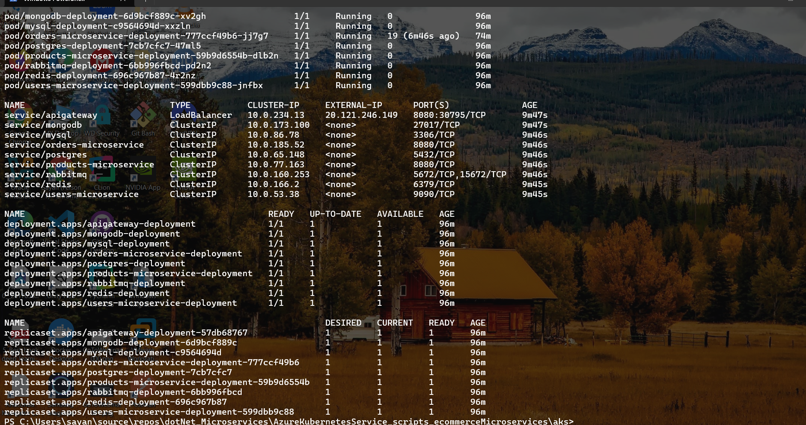

**08 · Troubleshooting deployment issues**<br/>
Working through deployment issues with `kubectl`.

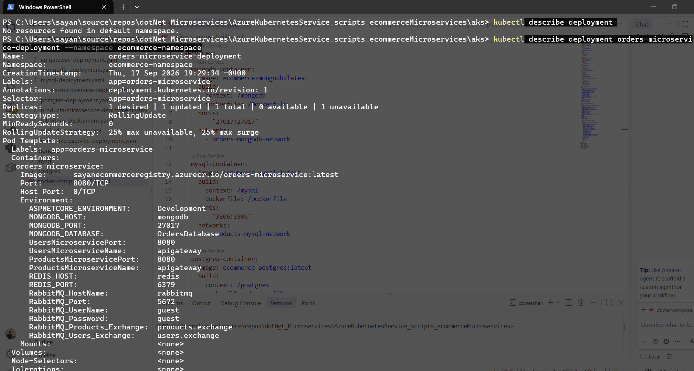

**09 · Results after fixing the Service manifest**<br/>
Requests answered from Azure once the Service manifest was corrected.


**10 · Services registered in AKS**<br/>
The cluster's Kubernetes Services as registered in AKS.

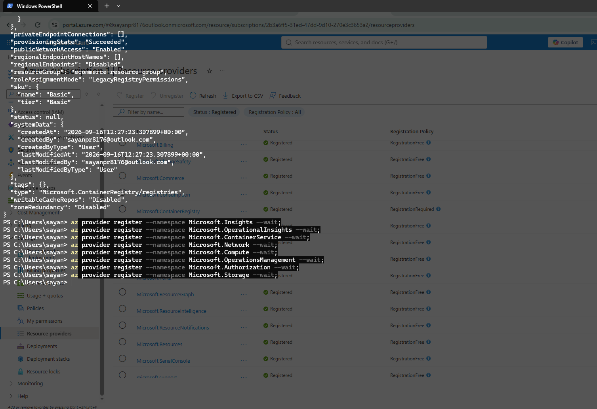

**11 · Pods running after a successful deployment**<br/>
All pods up and running after a successful rollout.

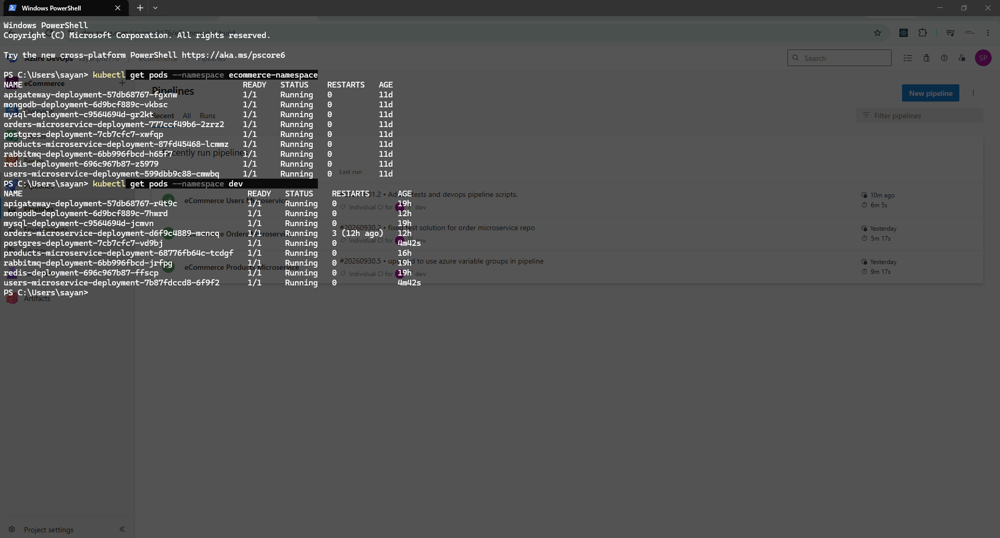

**12 · Project resource group**<br/>
`ecommerce-resource-group` (East US) holds the AKS cluster, the Container Registry, Key Vault, API Management, the Service Bus namespace and the External ID tenant.

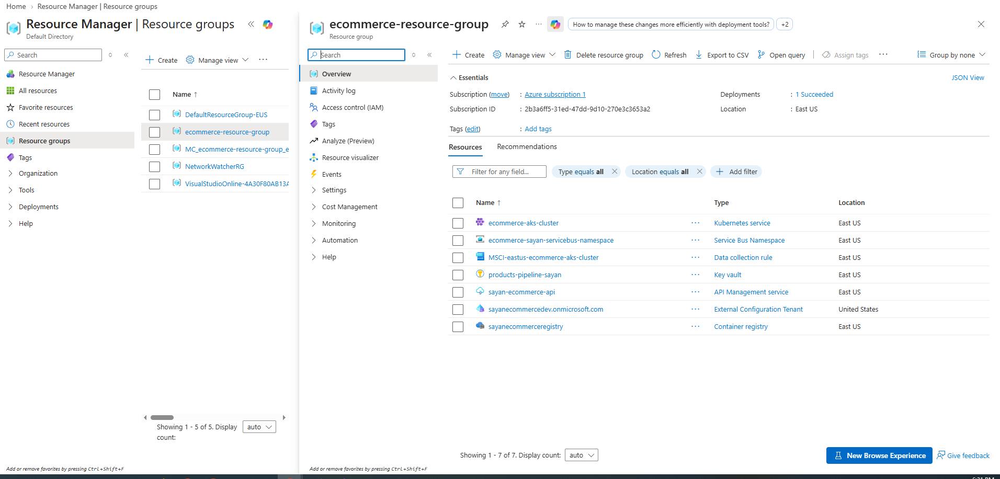

**13 · AKS workloads**<br/>
The full stack in two namespaces, `ecommerce-namespace` and the pipeline-managed `dev`, with nine Deployments each, all ready.

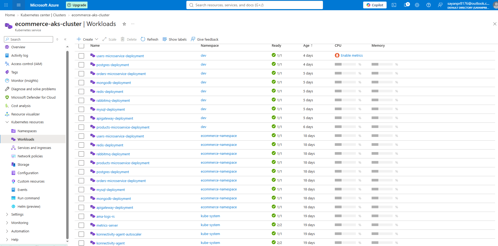

**14 · Azure Container Registry**<br/>
`sayanecommerceregistry` with seven repositories: the gateway, the three services and the three database images.

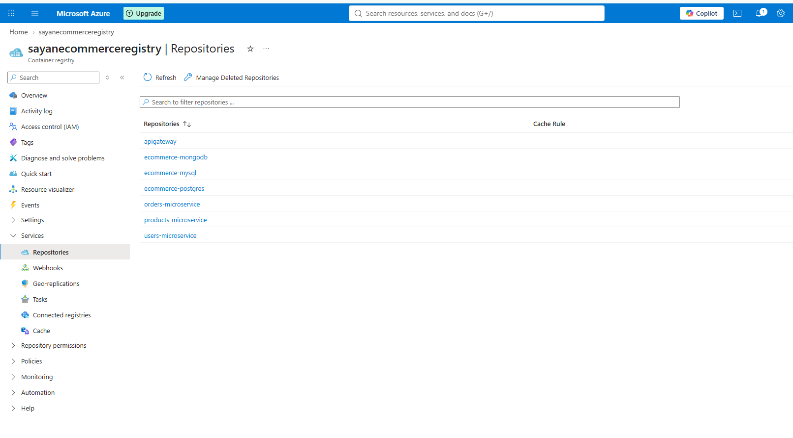

</details>

<p align="right"><a href="#-project-snapshots">↑ Back to the phase list</a></p>

### 🔁 Phase 5 — CI/CD with Azure DevOps

One multi-stage pipeline per service: fetch secrets from Key Vault, build and push the image, run the unit tests, then deploy to the `dev` namespace, with access to Azure resources through service connections.

<details open>
<summary><b>📸 Snapshots 15 – 23</b></summary>
<br/>

**15 · All services deployed through Azure Pipelines**<br/>
One pipeline per service (Users, Orders, Products), each green on its latest `dev` run.

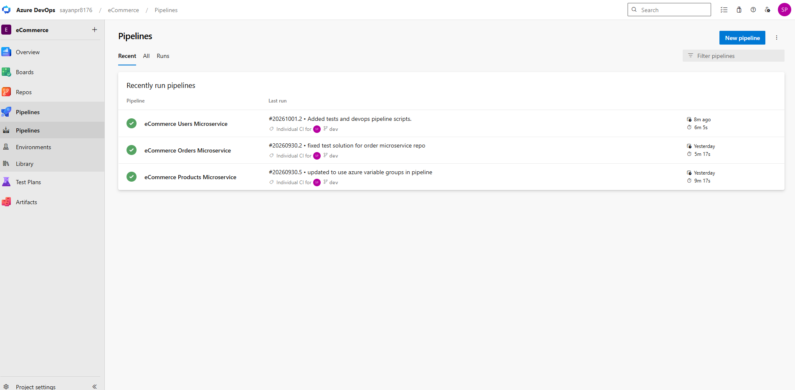

**16 · Calling the services after the pipeline deployments**<br/>
Pods healthy in both namespaces, each namespace's gateway on its own LoadBalancer IP, and a `GET /gateway/orders` returning composed orders with product and buyer details.

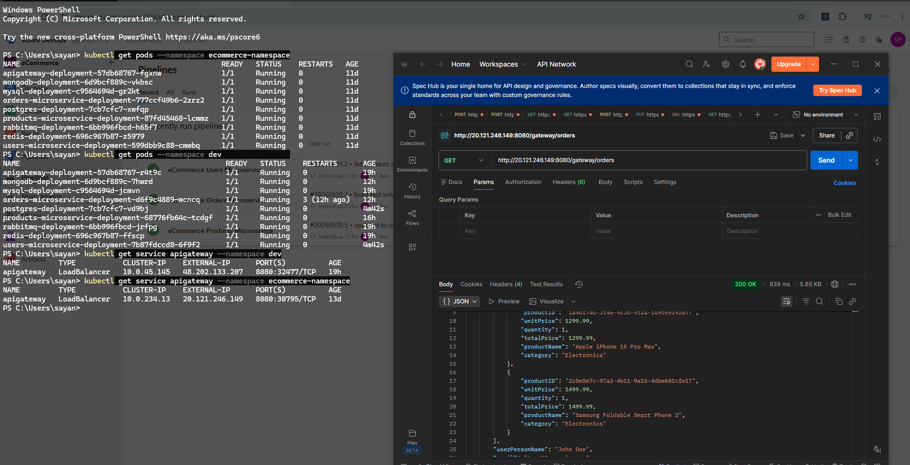

**17 · Products microservice in Azure Repos**<br/>
The Products microservice repository in Azure Repos.

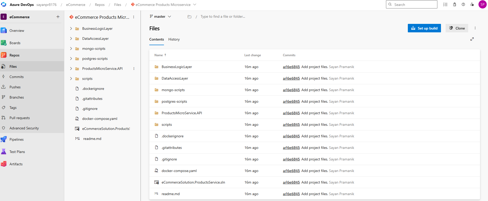

**18 · Users microservice pipeline**<br/>
The Users microservice pipeline in Azure DevOps.

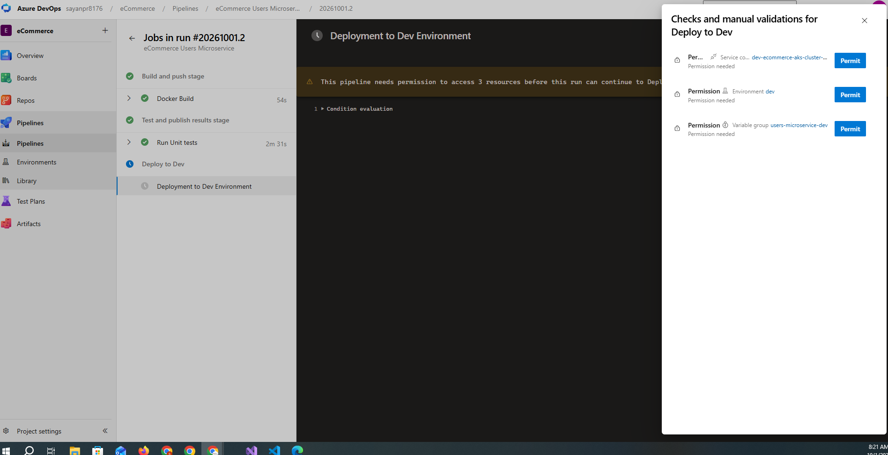

**19 · Azure Key Vault**<br/>
The Key Vault that holds the pipeline's secrets.

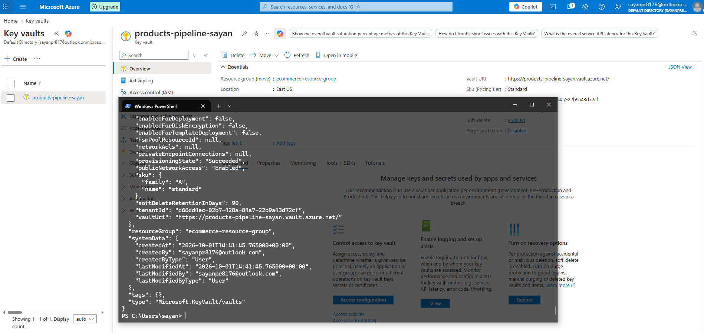

**20 · Key Vault secrets flowing into the pipeline**<br/>
Products pipeline mid-run: secrets fetched from Key Vault, image built and pushed, unit tests running, deployment waiting its turn.

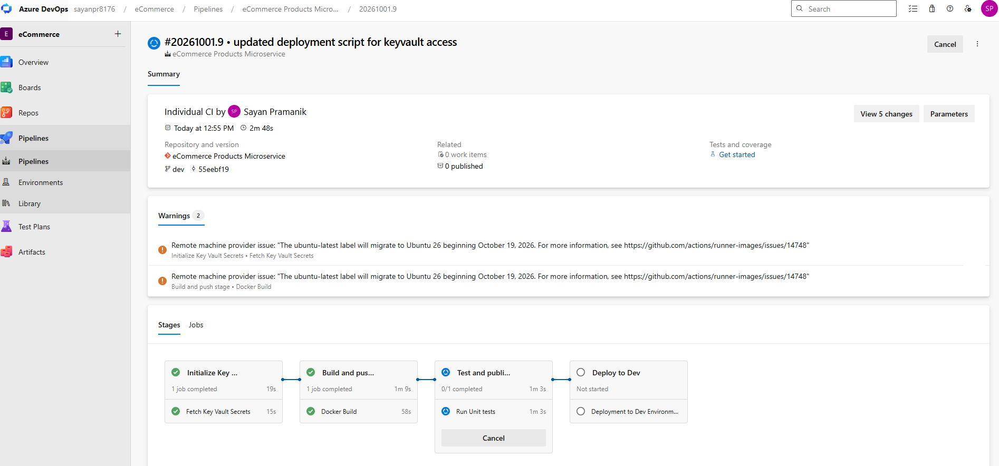

**21 · The same run, completed**<br/>
All four stages green, 100% of tests passed and the deployment check passed.

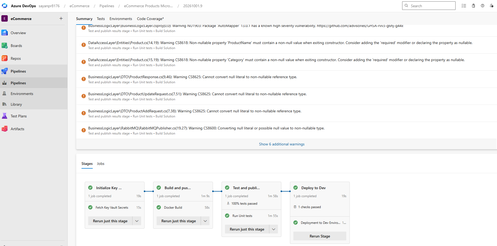

**22 · Unit tests running in the pipeline**<br/>
The Products microservice tests running in the pipeline.

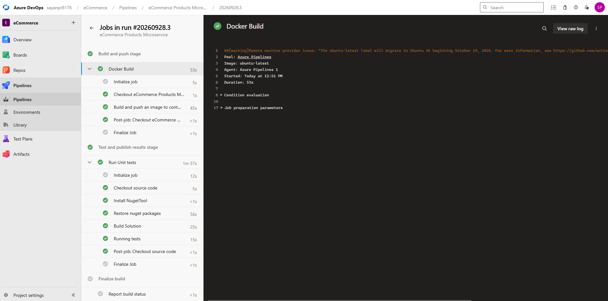

**23 · Published test results**<br/>
Test results for the Products microservice, published to the pipeline run.

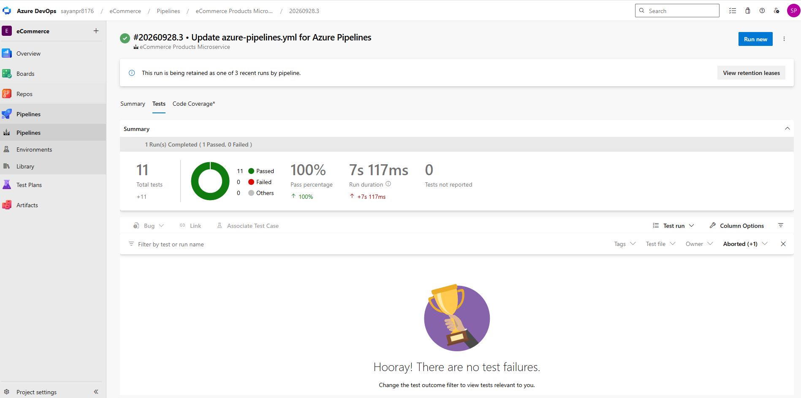

</details>

<p align="right"><a href="#-project-snapshots">↑ Back to the phase list</a></p>

### 🚦 Phase 6 — Azure API Management

API Management fronts the cluster: APIs are imported from each service's OpenAPI spec, and CORS and JWT validation run before a request reaches Ocelot.

<details open>
<summary><b>📸 Snapshots 24 – 26</b></summary>
<br/>

**24 · APIs imported from OpenAPI**<br/>
The three APIs created from each service's OpenAPI document; the test console sends a login request through the APIM hostname.

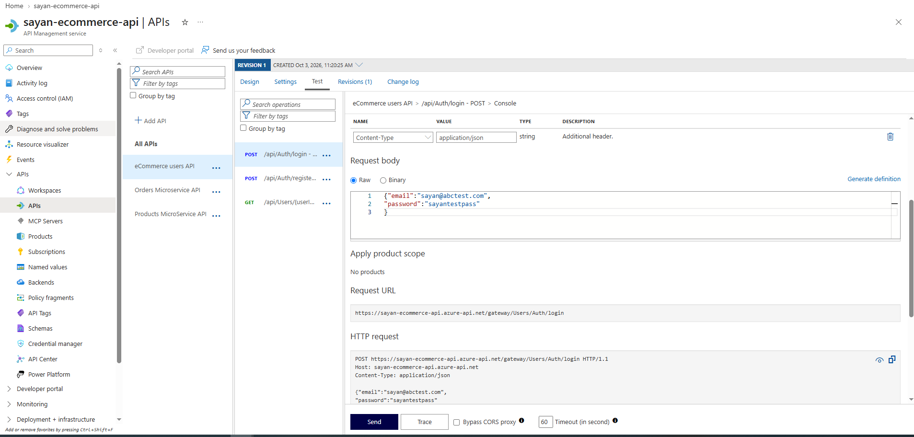

**25 · Inbound processing on the Orders API**<br/>
All Orders operations share `base` → `cors` → `validate-jwt` inbound policies, and the backend points at the Ocelot gateway on AKS.

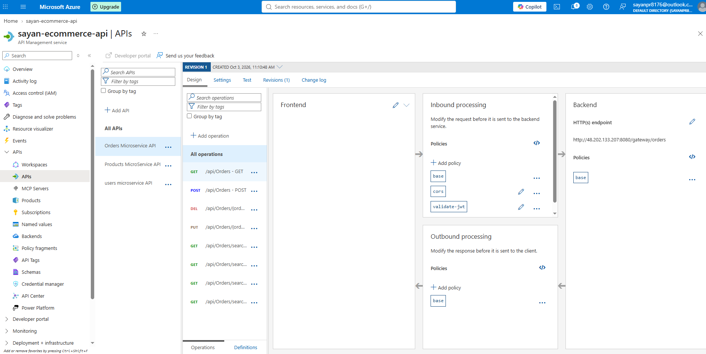

**26 · A response through the APIM URL**<br/>
`200 OK` for *Get all products* via API Management. The `x-rate-limit-*` headers come from Ocelot, which shows the request travelled APIM → Ocelot → Products.


</details>

<p align="right"><a href="#-project-snapshots">↑ Back to the phase list</a></p>

### 🔐 Phase 7 — Microsoft Entra External ID

Customer sign-up and sign-in run on an Entra External ID tenant, the successor to Azure AD B2C. Its tokens are the ones API Management validates.

<details open>
<summary><b>📸 Snapshots 27 – 28</b></summary>
<br/>

**27 · App registration for the client**<br/>
*eCommerce Client* registered as a single-page application in the External ID tenant, with its redirect and front-channel logout URIs.

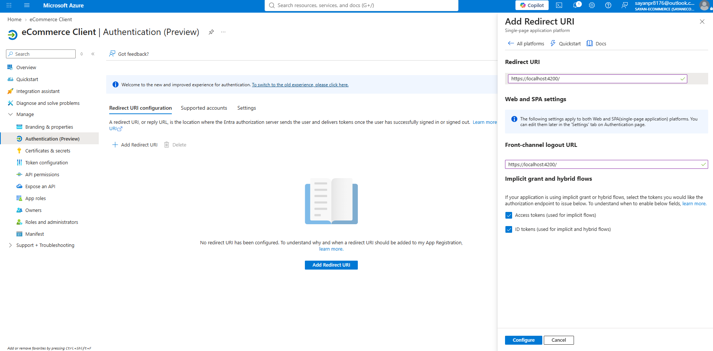

**28 · Hosted sign-up page**<br/>
The tenant-branded sign-up page on `ciamlogin.com`, collecting given name and surname during registration.

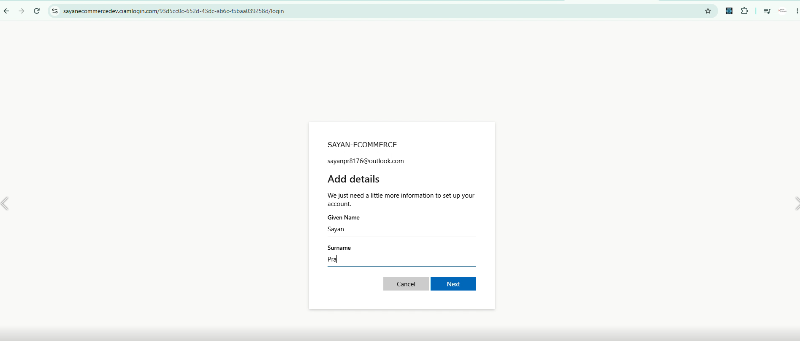

</details>

<p align="right"><a href="#-project-snapshots">↑ Back to the phase list</a></p>

### 📨 Phase 8 — Azure Service Bus

Service Bus topics carry events in both directions: `products.updates` refreshes the Orders service's Redis cache, and `orders.placed` lets Products reduce stock.

<details open>
<summary><b>📸 Snapshots 29 – 31</b></summary>
<br/>

**29 · A product update reaching the topic**<br/>
A product `PUT` through API Management (`200 OK`) and the `products.updates` topic metrics moving with it: messages in equal messages out, with no server errors.

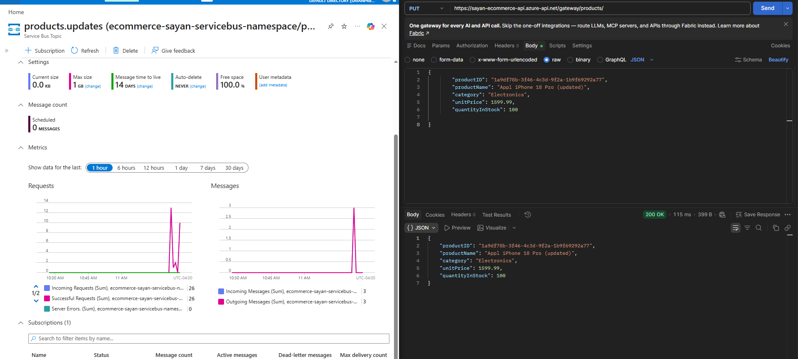

**30 · Peeking the Orders subscription**<br/>
Service Bus Explorer on `products.updates.orders`: the product JSON in the body, `event: product.update` and `RowCount: 1` as custom properties, and an empty dead-letter queue.

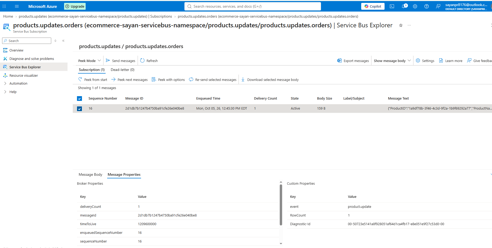

**31 · Both transports delivering**<br/>
Orders logs: every product update arrives twice, once from the RabbitMQ consumer and once from the Service Bus consumer (tagged *Servicebus notification*).

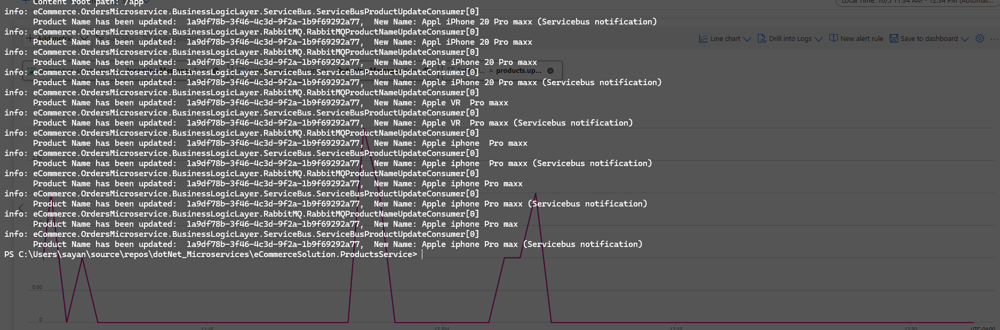

</details>

<p align="right"><a href="#-project-snapshots">↑ Back to the phase list</a></p>

---
## 📐 Architecture

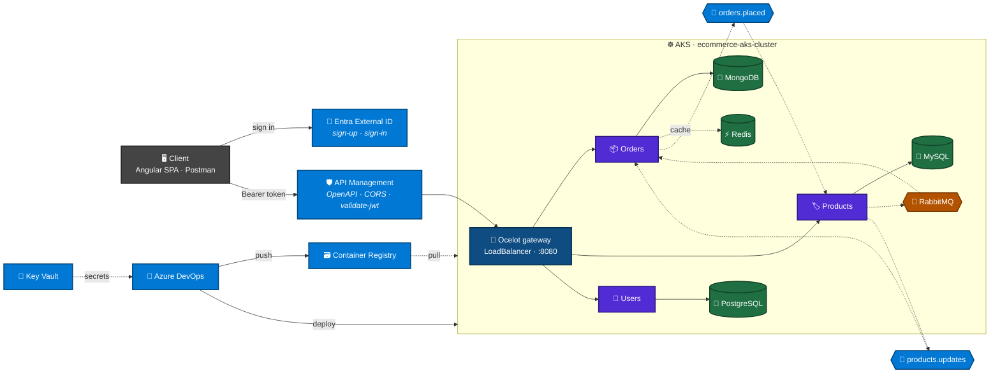
```mermaid
flowchart LR
    CLIENT["🖥️ Client<br/>Angular SPA · Postman"]
    ENTRA["🔐 Entra External ID<br/><i>sign-up · sign-in</i>"]
    APIM["🛡️ API Management<br/><i>OpenAPI · CORS · validate-jwt</i>"]

    subgraph AKS["☸️ AKS · ecommerce-aks-cluster"]
        GW["🚪 Ocelot gateway<br/>LoadBalancer · :8080"]
        ORD["📦 Orders"]
        PRD["🏷️ Products"]
        USR["👤 Users"]
        MG[("🍃 MongoDB")]
        MY[("🐬 MySQL")]
        PG[("🐘 PostgreSQL")]
        RD[("⚡ Redis")]
        MQ{{"🐇 RabbitMQ"}}
    end

    T1{{"📨 products.updates"}}
    T2{{"📨 orders.placed"}}
    ADO["🔁 Azure DevOps"]
    KV["🔑 Key Vault"]
    ACR["🗃️ Container Registry"]

    CLIENT -->|"sign in"| ENTRA
    CLIENT -->|"Bearer token"| APIM
    APIM --> GW
    GW --> ORD
    GW --> PRD
    GW --> USR
    ORD --> MG
    PRD --> MY
    USR --> PG
    ORD -.->|"cache"| RD
    PRD -.-> MQ
    MQ -.-> ORD
    PRD -.-> T1
    T1 -.-> ORD
    ORD -.-> T2
    T2 -.-> PRD
    KV -.->|"secrets"| ADO
    ADO -->|"push"| ACR
    ACR -.->|"pull"| AKS
    ADO -->|"deploy"| AKS

    classDef svc fill:#512BD4,stroke:#2f1a80,color:#ffffff,stroke-width:2px
    classDef db fill:#1f6f43,stroke:#124228,color:#ffffff,stroke-width:2px
    classDef az fill:#0078D4,stroke:#004578,color:#ffffff,stroke-width:2px
    classDef edgeNode fill:#0f4c81,stroke:#08304f,color:#ffffff,stroke-width:2px
    classDef mq fill:#b35300,stroke:#7a3800,color:#ffffff,stroke-width:2px
    classDef client fill:#444444,stroke:#222222,color:#ffffff,stroke-width:2px

    class ORD,PRD,USR svc
    class MG,MY,PG,RD db
    class ENTRA,APIM,T1,T2,ADO,KV,ACR az
    class GW edgeNode
    class MQ mq
    class CLIENT client
```

Clients sign in through Entra External ID and call API Management with the token. APIM checks CORS and the JWT, then forwards to the Ocelot gateway, the only workload in the cluster with a public address. Orders calls Users and Products back through the gateway, caches their answers in Redis, and keeps that cache fresh from RabbitMQ and Service Bus events.

### Azure resources

Everything lives in `ecommerce-resource-group` (East US).

| Resource | Type | Role |
|---|---|---|
| `ecommerce-aks-cluster` | Kubernetes service | Runs all nine workloads, in `ecommerce-namespace` and the pipeline-managed `dev` |
| `sayanecommerceregistry` | Container registry | Seven images: the gateway, three services and three databases |
| `sayan-ecommerce-api` | API Management service | Public entry point that applies CORS and JWT validation |
| `products-pipeline-sayan` | Key vault | Secrets the Products pipeline reads at run time |
| `ecommerce-sayan-servicebus-namespace` | Service Bus namespace | Topics `products.updates` and `orders.placed` |
| `sayanecommercedev.onmicrosoft.com` | External Configuration Tenant | Entra External ID tenant for customer sign-in |
| `MSCI-eastus-ecommerce-aks-cluster` | Data collection rule | Container monitoring for the cluster |

---

## 🚀 Using These Files

### Folder layout

`docker-compose.build.yaml` builds the services from their solution folders, so clone this repository next to them:

```text
your-workspace/
├── eCommerceSolution.OrdersService/      # Orders API + the ApiGateway project
├── eCommerceSolution.ProductsService/
├── eCommerceSolution.UsersService/
└── ecommerce_microservice_proj_docker_aks_azure_related_files/   # ← run Compose from here
```

```bash
git clone https://github.com/sayanpr8175/eCommerceSolution.OrdersService.git
git clone https://github.com/sayanpr8175/eCommerceSolution.ProductsService.git
git clone https://github.com/sayanpr8175/eCommerceSolution.UsersService.git
git clone https://github.com/sayanpr8175/ecommerce_microservice_proj_docker_aks_azure_related_files.git
```

### What the Compose file runs

| Service | Image | Host ports | Networks |
|---|---|---|---|
| `apigateway` | `apigateway:latest`, built from the Orders solution's `ApiGateway` project | `5000` → `8080` | `ecommerce-network` |
| `orders-microservice` | `orders-microservice:latest` | — | `orders-mongodb-network`, `ecommerce-network` |
| `products-microservice` | `products-microservice:latest` | — | `products-mysql-network`, `ecommerce-network` |
| `users-microservice` | `users-microservice:latest` | — | `users-postgres-network`, `ecommerce-network` |
| `mongodb-container` | `ecommerce-mongodb:latest`, built from [`mongodb/`](mongodb) | `27017` | `orders-mongodb-network` |
| `mysql-container` | `ecommerce-mysql:latest`, built from [`mysql/`](mysql) | `3306` | `products-mysql-network` |
| `postgres-container` | `ecommerce-postgres:latest`, built from [`postgres/`](postgres) | `5432` | `users-postgres-network` |
| `redis` | `redis:latest` | `6379` | `ecommerce-network` |
| `rabbitmq` | `rabbitmq:3.8-management` | `5672`, `15672` | `ecommerce-network` |

The three services publish no host ports: clients reach them through the gateway, and Orders calls Users and Products through it as well. Each database shares a private network with its owning service only.

### Run the stack locally

```bash
cd ecommerce_microservice_proj_docker_aks_azure_related_files
docker compose -f docker-compose.build.yaml up -d --build

# Through the gateway (keep the trailing slash)
curl http://localhost:5000/gateway/Products/
curl http://localhost:5000/gateway/Orders/
```

The RabbitMQ management UI is at `http://localhost:15672`. The credentials in the Compose file are local development defaults.

### Deploy to Azure Kubernetes Service

```bash
# 1. Push each image to Azure Container Registry
az acr login --name sayanecommerceregistry
docker tag ecommerce-mysql:latest sayanecommerceregistry.azurecr.io/ecommerce-mysql:latest
docker push sayanecommerceregistry.azurecr.io/ecommerce-mysql:latest
#    ...repeat for the other images

# 2. Point kubectl at the cluster
az aks get-credentials --resource-group ecommerce-resource-group --name ecommerce-aks-cluster

# 3. Apply the manifests and watch the rollout
kubectl create namespace ecommerce-namespace
kubectl apply -f aks/ --namespace ecommerce-namespace
kubectl get all --namespace ecommerce-namespace

# 4. Find the gateway's public IP (EXTERNAL-IP) and call it
kubectl get service apigateway --namespace ecommerce-namespace
curl http://<EXTERNAL-IP>:8080/gateway/orders
```

The Azure DevOps pipelines automate the same build → push → deploy loop for the `dev` namespace (see [Phase 5](#-phase-5--cicd-with-azure-devops)).

---

## 🔗 Code Repositories

| Component | Repository | What's inside |
|---|---|---|
| 🚪 API Gateway | [eCommerceSolution.ApiGateway](https://github.com/sayanpr8175/eCommerceSolution.ApiGateway) | Ocelot routes, QoS and rate limiting |
| 🏷️ Products | [eCommerceSolution.ProductsService](https://github.com/sayanpr8175/eCommerceSolution.ProductsService) | Minimal APIs on MySQL; publishes product events and reduces stock on new orders |
| 👤 Users | [eCommerceSolution.UsersService](https://github.com/sayanpr8175/eCommerceSolution.UsersService) | Registration, login and profiles on PostgreSQL, plus Microsoft Graph |
| 📦 Orders | [eCommerceSolution.OrdersService](https://github.com/sayanpr8175/eCommerceSolution.OrdersService) | Orders on MongoDB, Redis cache, RabbitMQ and Service Bus consumers |

---

<div align="center">

Built by [Sayan Pramanik](https://github.com/sayanpr8175) · ⭐ Star the repos if this was useful

</div>
